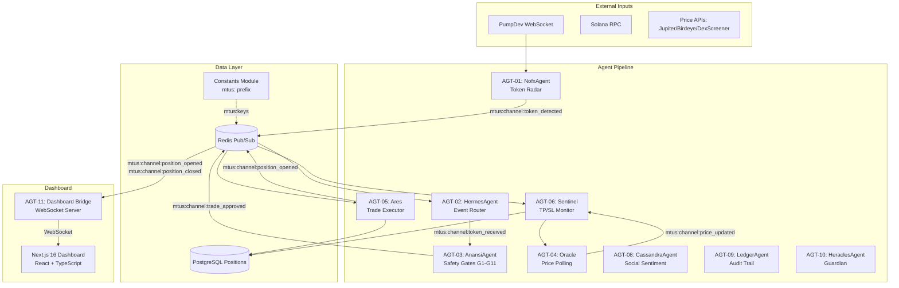
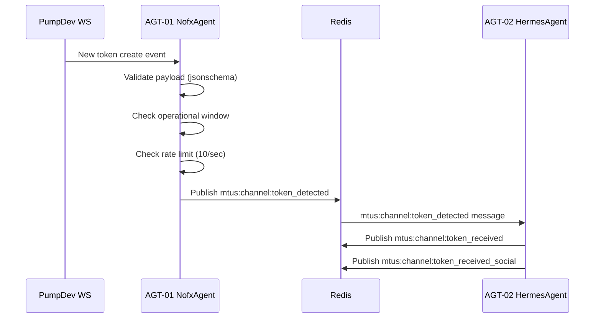
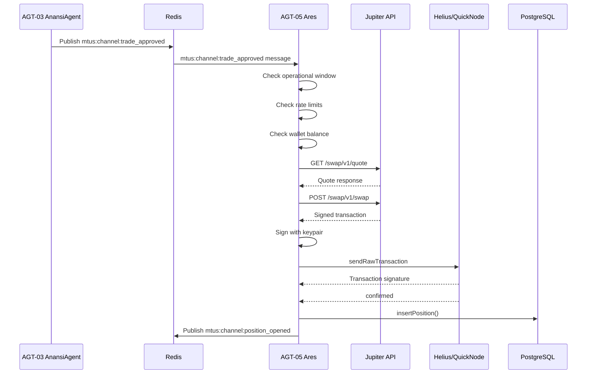
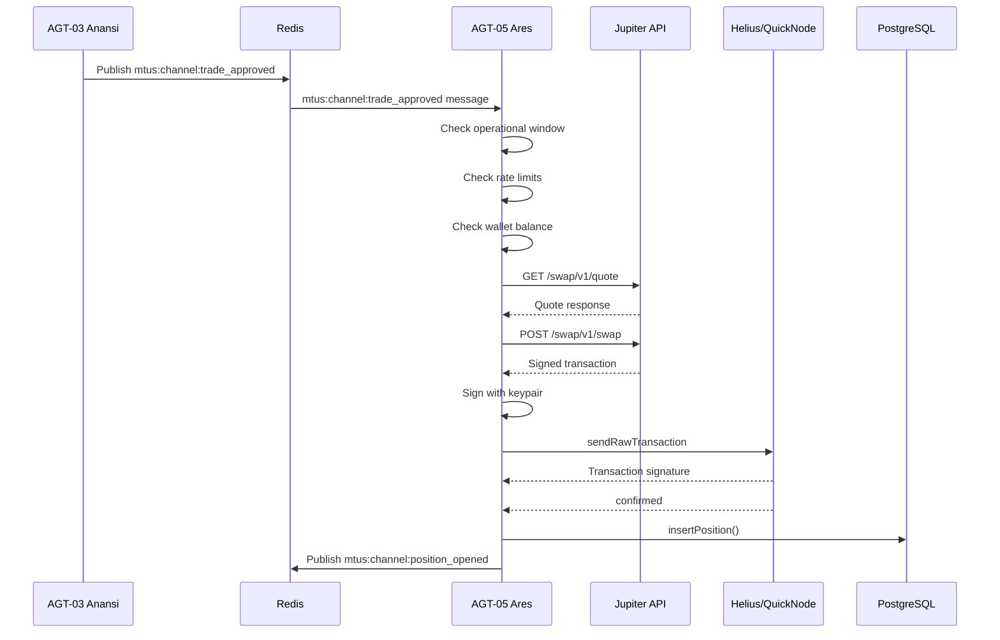

# MTUS (MemeTrader Unified System) - Technical Documentation
## Enterprise-Grade Solana Meme Coin Sniper Bot

---

# Table of Contents
1. [System Architecture Overview](#system-architecture-overview)
2. [Directory & File Manifest](#directory--file-manifest)
3. [Agent Deep-Dive](#agent-deep-dive)
4. [Core Engine Code Blocks](#core-engine-code-blocks)
5. [Configuration & Environment](#configuration--environment)
6. [Database Schema](#database-schema)
7. [Message Flow Diagrams](#message-flow-diagrams)
8. [Security & Secret Management](#security--secret-management)
9. [Dashboard Documentation](#dashboard-documentation)
10. [Test Suite](#test-suite)

---

# 1. System Architecture Overview

## 1.1 High-Level Architecture

The MTUS is a multi-agent system built on an event-driven architecture using Redis as the message bus. The system detects new tokens, validates them through a 10-gate safety pipeline, executes trades via Jupiter, and monitors positions for take-profit/stop-loss conditions.

## 1.2 System Logic Flow



## 1.3 State Management

| Component | State Storage | Mechanism |
|-----------|---------------|-----------|
| Agent Health | Redis | `mtus:agent:{agent_id}:health` |
| Active Positions | Redis + PostgreSQL | Redis Set + DB table |
| Token Dedup | Redis | `dedup:{mint}` with 24h TTL |
| Circuit Breaker | Redis | `mtus:circuit:{rpc_name}` |
| Rate Limiting | Redis | Hourly keys `mtus:trade_count:{hour}` |
| Daily PnL | Redis | `mtus:daily_pnl` with midnight expiry |
| Trading Config | Redis | `mtus:*` keys (position_size, tp/sl multipliers, etc.) |
| Kill Switch | Redis | `mtus:killswitch_triggered` |
| Trading Pause | Redis | `mtus:trading_paused` |
| Priority Queue | Redis | `mtus:trade_queue` (Sorted Set) |

---

# 2. Directory & File Manifest

## 2.1 Project Root Structure

```
D:\Trader/
├── .env                              # Environment variables (secrets)
├── .env.example                      # Template for env vars
├── config/
│   └── config.yaml                   # Master configuration
├── keystores/
│   ├── sniper.keystore               # Encrypted sniper wallet
│   └── main.keystore                 # Encrypted main wallet
├── data/
│   └── positions.db                  # Fallback SQLite database (sandbox only)
├── redis/
│   ├── redis-server.exe              # Redis for Windows
│   └── redis-cli.exe
├── src/
│   ├── python/                       # Python agents (AGT-01, 02, 03, 08, 09, 10)
│   │   ├── agents/
│   │   │   ├── nofx.py               # AGT-01: Token detection
│   │   │   ├── hermes.py             # AGT-02: Router
│   │   │   ├── anansi.py             # AGT-03: Safety gates
│   │   │   ├── oracle.py             # AGT-04: Price polling
│   │   │   ├── cassandra.py          # AGT-08: Sentiment
│   │   │   ├── ledger.py             # AGT-09: Audit
│   │   │   ├── heracles.py           # AGT-10: Guardian
│   │   │   ├── telegram_bot_agent.py # Telegram bot
│   │   │   └── dashboard_bridge.py   # AGT-11: WebSocket Bridge
│   │   └── shared/
│   │       ├── constants.py         # Centralized Redis keys/channels
│   │       ├── envelope.py           # Message schema
│   │       ├── keystore.py          # Encryption (Argon2id+XSalsa20)
│   │       ├── redis_client.py      # Redis connection
│   │       ├── telegram_bot.py      # Admin commands
│   │       ├── telegram_auth.py     # HMAC OTP
│   │       ├── paper_trading.py     # Paper trading engine
│   │       ├── circuit_breaker.py   # RPC health
│   │       ├── rpc_health.py        # RPC load balancer
│   │       ├── rate_limiter.py      # Trade limits
│   │       ├── position_validator.py # Position validation
│   │       ├── operational_window.py # Time-based trading
│   │       ├── token_payload.py     # Token data model
│   │       ├── notification_templates.py # Telegram messages
│   │       ├── incident_response.py # P0/P1 handling
│   │       ├── logging_config.py   # Structured logging
│   │       ├── validators.py       # Input validation
│   │       ├── logger.py           # Logger setup
│   │       ├── priority_queue.py    # Priority queue (Sorted Set)
│   │       └── solana_simulator.py # Honeypot detection
│   │
│   └── typescript/                   # TypeScript agents (AGT-05, 06, 07)
│       ├── agents/
│       │   ├── ares.ts              # AGT-05: Trade executor
│       │   ├── sentinel.ts          # AGT-06: TP/SL monitor
│       │   ├── janus.ts             # AGT-07: Capital sweep
│       │   ├── ares_start.ts        # Entry point
│       │   ├── ares.test.ts         # Unit tests
│       │   ├── sentinel.test.ts     # Unit tests
│       │   └── janus.test.ts        # Unit tests
│        └── shared/
            ├── envelope.ts          # Message schema
            ├── keystore.ts          # Keypair loading
            ├── db.ts                # PostgreSQL connection (node-postgres pool-backed)
│           ├── circuit-breaker.ts   # RPC health
│           ├── operational-window.ts # Time check
│           ├── mock_redis.ts        # Test fallback
│           └── telegram_auth.ts    # OTP verification
│
├── dist/                            # Compiled TypeScript
│   └── (generated by npm run build)
│
├── scripts/                         # Utility scripts
│   └── transfer_sol.py           # Transfer SOL between wallets
│
├── tests/                          # Python + TS tests
│   ├── unit/                      # Unit tests
│   ├── integration/              # Integration tests (real Redis)
│   ├── chaos/                   # Chaos tests (Redis/RPC failures)
│   └── security/                 # Security tests
│
└── dashboard/                      # React UI (Next.js 16)
    ├── src/
    │   ├── app/                   # Next.js app router
    │   │   ├── api/               # REST API routes
    │   │   │   ├── positions/route.ts
    │   │   │   ├── config/route.ts
    │   │   │   ├── wallets/route.ts
    │   │   │   ├── activity/route.ts
    │   │   │   └── control/route.ts
    │   │   ├── agents/page.tsx
    │   │   ├── positions/page.tsx
    │   │   ├── history/page.tsx
    │   │   ├── settings/page.tsx
    │   │   └── page.tsx           # Dashboard home
    │   ├── components/
    │   │   ├── lib/
    │   │   │   ├── websocket.tsx    # WebSocket client
    │   │   │   ├── api.ts          # API helper functions
    │   │   │   ├── solana-prices.ts # Token price fetching
    │   │   │   └── ...
    │   └── test/
    └── package.json
```

## 2.2 File Responsibilities

### Core Agents

| File | Responsibility |
|------|----------------|
| `nofx.py` | Connects to PumpDev/Whistle WebSocket, detects new token launches, publishes `mtus:channel:token_detected` events, uses priority queue |
| `hermes.py` | Subscribes to `mtus:channel:token_detected`, routes to Anansi and Cassandra via `mtus:channel:token_received` |
| `anansi.py` | Runs 10-gate safety qualification (G1-G11), publishes `mtus:channel:trade_approved` or `mtus:channel:trade_failed` |
| `oracle.py` | Polls prices every 5s from Jupiter/DexScreener/Birdeye, publishes `mtus:channel:price_updated` |
| `ares.ts` | Executes Jupiter swaps, broadcasts to RPC, records positions in PostgreSQL |
| `sentinel.ts` | Monitors open positions, triggers TP/SL based on state machine |
| `cassandra.py` | Fetches social sentiment scores from Twitter/Telegram APIs |
| `ledger.py` | Records all trade events to audit_ledger table |
| `heracles.py` | Health monitoring, kill switch, mainnet readiness checks (uses `is_paper_mode()` function) |
| `dashboard_bridge.py` | Bridges Redis pub/sub to WebSocket clients (ws://0.0.0.0:3001) |

### Shared Modules

| File | Responsibility |
|------|----------------|
| `constants.py` | **NEW**: Centralized Redis keys, pub/sub channels, `is_paper_mode()` function |
| `envelope.py/ts` | `AgentMessageEnvelope` schema with UUID, agent_id, event_type, payload |
| `keystore.py/ts` | Argon2id KDF + XSalsa20-Poly1305 encryption for wallet keys |
| `circuit_breaker.py/ts` | Tracks RPC failures, opens circuit after 3 consecutive failures |
| `operational_window.py/ts` | Checks if current time is within trading window |
| `db.ts` | PostgreSQL with node-postgres pool, position/audit tables |
| `telegram_bot.py` | 10 commands: /start, /status, /killswitch, /exit, etc. |
| `telegram_auth.py` | HMAC-SHA256 OTP generation/verification |
| `paper_trading.py` | Simulates Jupiter swaps without on-chain execution |
| `priority_queue.py` | Redis Sorted Set priority queue (lower score = higher priority) |
| `rate_limiter.py` | Trade limits (max/hour, max concurrent positions) |
| `validators.py` | Input validation (base58, URLs, positive numbers) |

---

# 3. Agent Deep-Dive

## 3.1 AGT-01: NofxAgent (Token Radar)

### Purpose
Continuously monitors PumpDev WebSocket for new token launches and publishes `mtus:channel:token_detected` events. Uses priority queue for token prioritization.

### Input/Output

| Parameter | Type | Description |
|-----------|------|-------------|
| Input | WebSocket Stream | `wss://pumpdev.io/ws` |
| Output | Redis Pub/Sub | Channel: `mtus:channel:token_detected` |
| Output | Redis List | Key: `event:token_detected:0` |
| Output | Redis Sorted Set | Key: `mtus:trade_queue` (priority queue) |

### Key Methods

```python
async def connect_pumpdev(delay: int = 0) -> bool:
    """Connect with fallback: PumpDev → Whistle → Pump4Dev"""

async def handle_pumpdev_message(payload: dict):
    """Process: create, buy, sell, complete, whale, devSell, koth"""

async def _handle_new_token(payload: dict):
    """Validate via jsonschema, create token payload, 
    check operational window, check rate limit, enqueue to priority queue"""

async def calculate_priority(tx_type: str, v_sol: int) -> int:
    """Priority: 1=migration, 2=bonding curve (>=30 SOL), 3=new"""
```

### Priority Queue Logic

| Priority | Condition | Score Calculation |
|-----------|-----------|-------------------|
| 1 (Highest) | Migration events (complete, create_pool) | `1 * 1e12 + timestamp` |
| 2 (Medium) | Bonding curve with >=30 SOL | `2 * 1e12 + timestamp` |
| 3 (Lowest) | New token creations | `3 * 1e12 + timestamp` |

---

## 3.2 AGT-02: HermesAgent (Event Router)

### Purpose
Routes `mtus:channel:token_detected` events to Anansi (safety) and Cassandra (sentiment) in parallel.

### Input/Output

| Parameter | Type | Description |
|-----------|------|-------------|
| Input | Redis Sub | Channels: `mtus:channel:token_detected`, `mtus:channel:token_migrated` |
| Output | Redis Pub/Sub | Channel: `mtus:channel:token_received` → Anansi |
| Output | Redis Pub/Sub | Channel: `mtus:channel:token_received_social` → Cassandra |

---

## 3.3 AGT-03: AnansiAgent (Safety Qualification)

### Purpose
Executes 10-gate safety qualification pipeline. Publishes `mtus:channel:trade_approved` or `mtus:channel:trade_failed`.

### Gate Definitions (G1-G11)

| Gate | Check | Threshold | Source |
|------|-------|-----------|--------|
| G1 | Mint Authority Revoked | `mintAuthority == null` | RugCheck / RPC |
| G2 | Freeze Authority Revoked | `freezeAuthority == null` | RugCheck |
| G3 | LP Burned | ≥85% | RugCheck |
| G4 | Dev Holdings | <5% (disabled for pump.fun) | getTokenLargestAccounts |
| G5 | Top 10 Concentration | <30% | getTokenLargestAccounts |
| G6 | RugCheck Score | ≤999 | RugCheck |
| G7 | Market Cap Range | 5-150 SOL | token payload |
| G8 | Social Metadata | ≥1 social link | Fetch URI |
| G9 | Duplicate Check | Not seen in 24h | Redis `mtus:dedup:{mint}` |
| G10 | Honeypot Check | No freeze/mint authority | getAccountInfo |
| G11 | Bonding Curve Health | ≥30 SOL in curve | token payload |

### Key Methods

```python
async def check_g1_mint_authority(mint: str) -> bool:
    """Gate 1: Mint authority must be null"""

async def check_g7_market_cap(market_cap: float) -> bool:
    """Gate 7: min_market_cap_sol ≤ market_cap ≤ max_market_cap_sol"""

async def qualify_token(self, token_payload: Dict, correlation_id: str) -> bool:
    # Always run G7 (market cap) first
    mcap = token_payload.get("marketCapSol", 0)
    if not (5 <= mcap <= 150):
        return False
    
    # Always run G11 (bonding curve)
    v_sol = token_payload.get("vSolInBondingCurve", 0) / 1e9
    if v_sol < 30:
        return False
    
    # Run G1, G2 (critical)
    # Paper mode: skip G3-G9
    # Production: run all gates
    
    # Require all required gates to pass
    required_gates = ["G1", "G2", "G7", "G10", "G11"]
```

---

## 3.4 AGT-04: Oracle (Price Polling)

### Purpose
Polls token prices every 5 seconds from multiple sources for Sentinel monitoring.

### Input/Output

| Parameter | Type | Description |
|-----------|------|-------------|
| Input | Redis Sub | Channel: `position_opened` |
| Output | Redis Pub/Sub | Channel: `price_updated` |

### Key Methods

```python
async def fetch_price_jupiter(mint: str) -> float:
    """Primary: Jupiter V3 API"""

async def fetch_price_dexscreener(mint: str) -> float:
    """Secondary: DexScreener API"""

async def fetch_price_birdeye(mint: str) -> float:
    """Tertiary: Birdeye (if API key)"""

async def update_position_price(self, position_id: str, mint: str):
    """Poll prices, update buffer, publish price_updated"""
```

### Fallback Chain
1. Jupiter V3 (`https://api.jup.ag/price/v3?ids={mint}`)
2. DexScreener (`https://api.dexscreener.com/latest/dex/tokens/{mint}`)
3. Birdeye (if `BIRDEYE_API_KEY` set)

---

## 3.5 AGT-05: Ares (Trade Executor)

### Purpose
Executes Jupiter swaps for qualified tokens, broadcasts to RPC, records positions.

### Input/Output

| Parameter | Type | Description |
|-----------|------|-------------|
| Input | Redis Sub | Channel: `trade_approved` |
| Output | Redis Pub/Sub | Channel: `position_opened` |
| Output | PostgreSQL | `positions` table |

### Key Configuration

```typescript
const POSITION_SIZE_SOL = 0.0005;  // Default position size
const MAX_SLIPPAGE_BPS = 2000;    // Max slippage (20%)
const SLIPPAGE_LADDER = [1000, 1500, 2000];  // Retry with higher slippage
const MAX_TRADES_PER_HOUR = 3;
const MAX_CONCURRENT_POSITIONS = 1;
const DAILY_LOSS_LIMIT_SOL = 0.002;
const PRIORITY_FEE_CAP_SOL = 0.001;  // Max priority fee
```

### Jupiter API Selection Logic

| Condition | API Version | Slippage Handling |
|-----------|-------------|-------------------|
| Trade value <$6 | v1 API | Slippage ladder: 10% → 15% → 20% |
| Trade value ≥$6 | v2 API | RTSE (Jupiter's Real-Time Slippage Engine) |

### Core Engine Code: Transaction Signing

```typescript
// Step 1: Get SOL price for USD calculation
const solPrice = await getSolUsdPrice();
const tradeValueUsd = positionSizeSol * solPrice;

// Step 2: Select API version
const useV2 = tradeValueUsd >= 6;
const apiVersion = useV2 ? 'v2' : 'v1';

// Step 3: Get quote with priority fees
const quoteUrl = `https://api.jup.ag/swap/v1/quote?inputMint=${inputMint}&outputMint=${mint}&amount=${amount}&slippageBps=1000`;
const quoteData = await (await fetch(quoteUrl)).json();

// Step 4: Get swap transaction
const swapRes = await fetch('https://api.jup.ag/swap/v1/swap', {
    method: 'POST',
    headers: { 'Content-Type': 'application/json' },
    body: JSON.stringify({
        quoteResponse: quoteData,
        userPublicKey: keypair.publicKey.toBase58(),
        wrapUnwrapSOL: true,
        prioritizationFeeLamports: "auto",
        maxPrioritizationFeeLamports: 1000000,  // 0.001 SOL cap
    }),
});
const swapData = await swapRes.json();

// Step 5: Deserialize and sign
const txBytes = Buffer.from(swapData.swapTransaction, 'base64');
const versionedTx = VersionedTransaction.deserialize(txBytes);
versionedTx.sign([keypair]);

// Step 6: Broadcast to RPCs with fallback
const txId = await connection.sendRawTransaction(versionedTx.serialize(), {
    skipPreflight: false,
    preflightCommitment: 'processed',
    maxRetries: 5,
});

// Step 7: Wait for confirmation
const status = await connection.getSignatureStatus(txId);

// Step 8: Record position in PostgreSQL
insertPosition.run({
    position_id: correlationId,
    mint: mint,
    entry_price_sol: entryPriceSol,
    tokens_received: tokensReceived,
    state: 'OPEN',
    tp1_price: entryPriceSol * 2,
    tp2_price: entryPriceSol * 5,
    sl_price: entryPriceSol * 0.7,
});
```

---

## 3.6 AGT-06: Sentinel (TP/SL Monitor)

### Purpose
Monitors open positions, triggers take-profit/stop-loss based on price movements.

### Input/Output

| Parameter | Type | Description |
|-----------|------|-------------|
| Input | Redis Sub | Channel: `position_opened` |
| Input | Redis Sub | Channel: `price_updated` |
| Output | Redis Pub/Sub | Channels: `tp1_hit`, `tp2_hit`, `stop_loss_hit`, `trailing_stop_hit`, `time_sl_hit` |

### State Machine

```typescript
type PositionState = 
  | 'OPEN'           // Just entered, watching for TP1 or SL
  | 'TAKE_PROFIT_1'  // TP1 hit, sold 50%, trailing 15%
  | 'TRAILING'       // After TP1, watching trailing stop
  | 'TAKE_PROFIT_2'  // TP2 hit, sold remaining 50%
  | 'STOP_LOSS'      // SL hit, sell all
  | 'TIME_SL'        // 4h without TP1, force exit
  | 'CLOSED'         // All positions exited
  | 'FAILED'         // Trade failed
```

### TP/SL Levels

| Level | Trigger | Action |
|-------|---------|--------|
| TP1 | price ≥ entry × 2.0 | Sell 50%, trail at 85% of peak |
| TP2 | price ≥ entry × 5.0 | Sell remaining 50% |
| SL | price ≤ entry × 0.7 | Sell all |
| Trailing | price ≤ peak × 0.85 | Sell remaining after TP1 |
| Time SL | 4 hours without TP1 | Force sell all |

---

## 3.7 AGT-11: DashboardBridge (WebSocket Server)

### Purpose
Bridges Redis pub/sub messages to WebSocket clients for dashboard consumption.

### Configuration

| Parameter | Default | Description |
|-----------|---------|-------------|
| WebSocket Port | 3001 | `ws://0.0.0.0:3001` |
| Redis URL | `redis://localhost:6379` | Redis connection |

### Forwarded Channels (using `mtus:channel:` prefix)

| Redis Channel | WebSocket Message Type |
|----------------|------------------------|
| `mtus:channel:position_opened` | `position_opened` |
| `mtus:channel:position_closed` | `position_closed` |
| `mtus:channel:price_updated` | `price_updated` |
| `mtus:channel:health_check` | `health_check` |
| `mtus:channel:system_alert` | `system_alert` |
| `mtus:channel:kill_switch_triggered` | `kill_switch_triggered` |

```python
class DashboardBridge:
    async def forward_redis_messages(self):
        channels = [
            "mtus:channel:position_opened", 
            "mtus:channel:position_closed", 
            "mtus:channel:price_updated",
            "mtus:channel:health_check", 
            "mtus:channel:system_alert", 
            "mtus:channel:kill_switch_triggered"
        ]
        await self.pubsub.subscribe(*channels)
        
        while self.running:
            message = await self.pubsub.get_message(ignore_subscribe_messages=True, timeout=1.0)
            if message and message["type"] == "message":
                await self.broadcast_to_clients(message)
```

---

# 4. Core Engine Code Blocks

## 4.1 Token Detection (NofxAgent)

```python
# Location: src/python/agents/nofx.py:324-470
async def handle_pumpdev_message(self, payload: dict):
    tx_type = payload.get("txType")
    
    # New token creation
    if tx_type == "create":
        await self._handle_new_token(payload)
    
    # Migration events (PumpSwap)
    elif tx_type == "complete":
        print(f"Migration starting: {payload.get('mint')[:8]}...")
    
    elif tx_type == "create_pool":
        await self._publish_migration(payload)
    
    # Whale alert (≥5 SOL trades)
    elif tx_type == "whale":
        sol_amount = payload.get("solAmount", 0)
        if sol_amount >= 5:
            print(f"WHALE ALERT: {sol_amount} SOL")
    
    # Trades
    elif tx_type in ("buy", "sell"):
        print(f"{tx_type.upper()}: {payload.get('mint')[:8]}...")
```

**Note**: Uses `is_paper_mode()` function from `constants.py` instead of module-level `IS_PAPER_MODE` variable.

## 4.2 Safety Qualification (AnansiAgent)

```python
# Location: src/python/agents/anansi.py:474-680
async def qualify_token(self, token_payload, correlation_id):
    mint = token_payload["mint"]
    symbol = token_payload.get("symbol", "UNKNOWN")
    gates_passed = []
    gates_failed = []
    
    # G7: Market Cap (always run)
    mcap = token_payload.get("marketCapSol", 0)
    if not (5 <= mcap <= 150):
        gates_failed.append("G7")
        return False
    
    # G11: Bonding Curve (always run)
    v_sol = token_payload.get("vSolInBondingCurve", 0) / 1e9
    if v_sol < 30:
        gates_failed.append("G11")
        return False
    
    # G1, G2: Critical gates (always run)
    if await self.check_g1_mint_authority(mint):
        gates_passed.append("G1")
    else:
        gates_failed.append("G1")
    
    # Paper mode: skip G3-G9
    # Production: run remaining gates
    
    # Publish to mtus:channel:trade_approved if all required gates pass
    envelope = AgentMessageEnvelope(
        agent_id="AGT-03",
        event_type="mtus:channel:trade_approved",
        payload={...},
        correlation_id=correlation_id,
    )
    await self.redis.publish("mtus:channel:trade_approved", envelope.model_dump_json())
```

## 4.3 Trade Execution (Ares)

```typescript
// Location: src/typescript/agents/ares.ts:261-878
async executeTrade(mint: string, correlationId: string): Promise<void> {
    // 1. Operational window check
    if (!IS_PAPER_MODE && !isOperationalWindowActive()) {
        await this.redis.publish('trade_failed', ...);
        return;
    }
    
    // 2. Rate limit check
    const rateCheck = await this.rateLimiter.canTrade();
    if (!rateCheck.allowed) {
        await this.redis.publish('trade_failed', ...);
        return;
    }
    
    // 3. Get Jupiter quote (v1 for <$6, v2 for >=$6)
    const useV2 = tradeValueUsd >= 6;
    const quoteUrl = `https://api.jup.ag/swap/v1/quote?...`;
    const quoteData = await (await fetch(quoteUrl)).json();
    
    // 4. Get swap transaction with priority fees
    const swapRes = await fetch('https://api.jup.ag/swap/v1/swap', {
        method: 'POST',
        body: JSON.stringify({
            quoteResponse: quoteData,
            prioritizationFeeLamports: "auto",
            maxPrioritizationFeeLamports: 1000000,
        }),
    });
    
    // 5. Sign transaction
    const txBytes = Buffer.from(swapData.swapTransaction, 'base64');
    const versionedTx = VersionedTransaction.deserialize(txBytes);
    versionedTx.sign([this.keypair!]);
    
    // 6. Broadcast to RPCs with fallback
    const txId = await connection.sendRawTransaction(versionedTx.serialize());
    
    // 7. Wait for confirmation
    const status = await connection.getSignatureStatus(txId);
    
    // 8. Record position in PostgreSQL
    insertPosition.run({...});
}
```

## 4.4 TP/SL State Machine (Sentinel)

```typescript
// Location: src/typescript/agents/sentinel.ts:71-118
updatePositionState(position: Position, currentPrice: number): void {
    // Time-based SL (4h without TP1)
    if (position.state === 'OPEN' && (now - entryTime) > (4 * 60 * 60 * 1000)) {
        position.state = 'STOP_LOSS';
        this.sellPosition(position, 1.0, 'time_sl_hit');
        return;
    }
    
    if (position.state === 'OPEN') {
        // Check TP1
        if (currentPrice >= position.tp1_price) {
            position.state = 'TAKE_PROFIT_1';
            this.sellPosition(position, 0.5, 'tp1_hit');
        }
        // Check SL
        else if (currentPrice <= position.sl_price) {
            position.state = 'STOP_LOSS';
            this.sellPosition(position, 1.0, 'stop_loss_hit');
        }
    }
    else if (position.state === 'TAKE_PROFIT_1') {
        // Update peak
        if (currentPrice > position.peak_price_sol) 
            position.peak_price_sol = currentPrice;
        
        const trailingPrice = position.peak_price_sol * 0.85;
        
        // Check trailing stop
        if (currentPrice <= trailingPrice) {
            position.state = 'TRAILING';
            this.sellPosition(position, 0.5, 'trailing_stop_hit');
        }
        // Check TP2
        else if (currentPrice >= position.tp2_price) {
            position.state = 'TAKE_PROFIT_2';
            this.sellPosition(position, 0.5, 'tp2_hit');
        }
    }
}
```

---

# 5. Configuration & Environment

## 5.1 Environment Variables (.env)

```bash
# ==========================================
# RPC Providers (REQUIRED)
# ==========================================
HELIUS_KEY=your_helius_api_key
HELIUS_RPC_URL=https://mainnet.helius-rpc.com/?api-key=${HELIUS_KEY}
HELIUS_WSS=wss://mainnet.helius-rpc.com/?api-key=${HELIUS_KEY}

QUICKNODE_URL=https://your-quicknode-url
ALCHEMY_RPC_URL=https://solana-mainnet.g.alchemy.com/v2/your_key

# ==========================================
# Price APIs (OPTIONAL)
# ==========================================
BIRDEYE_API_KEY=your_birdeye_key
RUGCHECK_API_KEY=your_rugcheck_key

# ==========================================
# Telegram Bot (REQUIRED for admin)
# ==========================================
TELEGRAM_BOT_TOKEN=your_bot_token
TELEGRAM_ADMIN_CHAT_ID=your_chat_id
TELEGRAM_OTP_SEED=your_otp_seed

# ==========================================
# Redis (REQUIRED)
# ==========================================
REDIS_URL=redis://localhost:6379

# ==========================================
# Environment Mode (REQUIRED)
# ==========================================
MTUS_ENVIRONMENT=paper  # or "production"

# ==========================================
# Wallet Configuration (REQUIRED)
# ==========================================
SNIPER_KEYSTORE_PATH=./keystores/sniper.keystore
MAIN_KEYSTORE_PATH=./keystores/main.keystore
SNIPER_PASSPHRASE=your_passphrase

# ==========================================
# Dashboard (Next.js)
# ==========================================
NEXT_PUBLIC_WS_URL=ws://localhost:3001
POSITIONS_DB_PATH=D:/Trader/data/positions.db
```

**Note**: The `MTUS_ENVIRONMENT` variable is now consumed by the `is_paper_mode()` function in `constants.py` instead of module-level `IS_PAPER_MODE` variables.

## 5.2 config.yaml

```yaml
# Master Configuration — config/config.yaml

system:
  trading_active: true
  operational_window:
    start_hour_ist: 0   # 12:00 AM IST
    end_hour_ist: 24    # 11:59 PM IST
  environment: production  # or "paper"

wallets:
  sniper_keystore_path: ./keystores/sniper.keystore
  main_keystore_path: ./keystores/main.keystore
  sniper_max_balance_sol: 1.5
  sniper_low_water_sol: 0.3
  sweep_batch_size_sol: 0.8

trading:
  position_size_sol: 0.0005
  max_simultaneous_positions: 1
  max_trades_per_hour: 3
  daily_loss_limit_sol: 0.002
  tp1_multiplier: 2.0
  tp2_multiplier: 5.0
  sl_multiplier: 0.7
  trailing_stop_pct: 15
  time_sl_hours: 4
  priority_fee_cap_sol: 0.001

qualification:
  max_market_cap_sol: 150
  min_market_cap_sol: 5
  max_dev_holding_pct: 95
  max_top10_concentration_pct: 30
  min_lp_burned_pct: 85
  max_rugcheck_score: 999
  min_virtual_sol_reserves: 30
  min_bonding_curve_progress: 60

rpc:
  providers:
    - name: helius
      http_url: https://mainnet.helius-rpc.com/?api-key=...
      ws_url: wss://mainnet.helius-rpc.com/?api-key=...
      weight: 50
      priority: 1
    - name: quicknode
      http_url: ${QUICKNODE_URL}
      weight: 35
      priority: 2
    - name: alchemy
      http_url: https://solana-mainnet.g.alchemy.com/v2/...
      weight: 15
      priority: 3
    - name: public
      http_url: https://api.mainnet-beta.solana.com
      weight: 0
      priority: 4
  circuit_breaker_threshold: 3
  circuit_breaker_reset_sec: 60
```

## 5.3 Redis Configuration Keys

These keys are used for runtime configuration and can be updated via the Dashboard Settings page:

| Key | Type | Default | Description |
|-----|------|---------|-------------|
| `mtus:trading_mode` | String | "paper" | Trading mode |
| `mtus:position_size_sol` | Number | 0.0005 | Position size in SOL |
| `mtus:max_positions` | Number | 1 | Max concurrent positions |
| `mtus:tp1_multiplier` | Number | 2 | Take profit 1 multiplier |
| `mtus:tp2_multiplier` | Number | 5 | Take profit 2 multiplier |
| `mtus:sl_multiplier` | Number | 0.7 | Stop loss multiplier |
| `mtus:trading_active` | Boolean | true | Trading active state |
| `mtus:killswitch_triggered` | Boolean | false | Kill switch state |
| `mtus:trading_paused` | Boolean | false | Trading paused state |
| `mtus:priority_fee_cap_sol` | Number | 0.001 | Priority fee cap |
| `mtus:start_hour` | Number | 0 | Trading start hour |
| `mtus:end_hour` | Number | 24 | Trading end hour |

## 5.4 Secret Management

### Keystore Encryption

The sniper wallet is encrypted using Argon2id KDF + XSalsa20-Poly1305:

```python
# Location: src/python/shared/keystore.py
ARGON2_OPTIONS = {
    "time_cost": 4,
    "memory_cost": 65536,
    "parallelism": 2,
    "hash_len": 32,
    "type": argon2.Type.ID,
}

class Keystore:
    def load_keypair(self, passphrase: str) -> bytes:
        # 1. Read keystore JSON
        # 2. Decode salt, nonce, encrypted_secret from hex
        # 3. Derive key with Argon2id
        derived_key = argon2.low_level.hash_secret_raw(
            passphrase.encode("utf-8"), salt, **ARGON2_OPTIONS
        )
        # 4. Decrypt with XSalsa20-Poly1305
        box = nacl.secret.SecretBox(derived_key)
        return box.decrypt(encrypted_secret, nonce)
```

### Telegram OTP

HMAC-based one-time password for admin commands:

```python
# Location: src/python/shared/telegram_auth.py
import hmac
import hashlib

def generate_otp(secret: str, timestamp: int = None) -> str:
    """Generate 6+ digit OTP from HMAC-SHA256"""
    key = secret.encode()
    msg = str(timestamp or int(time.time())).encode()
    h = hmac.new(key, msg, hashlib.sha256)
    return str(int(h.hexdigest()[:6], 16) % 1000000

def verify_otp(secret: str, otp: str, window: int = 60) -> bool:
    """Verify OTP within time window"""
    now = int(time.time())
    for delta in range(-window, window+1):
        if generate_otp(secret, now + delta) == otp:
            return True
    return False
```

### Constants Module (NEW)

Centralized constants for Redis keys and channels in `src/python/shared/constants.py`:

```python
# Location: src/python/shared/constants.py
from typing import Dict, Any

# Environment function (replaces IS_PAPER_MODE variable)
def is_paper_mode() -> bool:
    return os.getenv("MTUS_ENVIRONMENT", "paper").lower() == "paper"

# Redis Key Prefix - All keys use mtus: prefix
MTUS_PREFIX = "mtus:"

# Pub/Sub Channels - All channels use mtus:channel: prefix
MTUS_CHANNEL_PREFIX = f"{MTUS_PREFIX}channel:"

CHANNEL_TOKEN_DETECTED = f"{MTUS_CHANNEL_PREFIX}token_detected"
CHANNEL_TRADE_APPROVED = f"{MTUS_CHANNEL_PREFIX}trade_approved"
# ... (all channels defined as constants)
```

### Agent ID Assignments

The system uses standardized Agent IDs defined in `src/python/shared/constants.py`:

| Agent ID | Constant Name | Agent Name | Purpose |
|----------|---------------|------------|---------|
| AGT-01 | `AGENT_NOFX` | NofxAgent | Token detection (PumpDev/Whistle) |
| AGT-02 | `AGENT_HERMES` | HermesAgent | Event routing & queue processing |
| AGT-03 | `AGENT_ANANSI` | AnansiAgent | Safety qualification (G1-G11) |
| AGT-04 | `AGENT_ORACLE` | OracleAgent | Price polling (Jupiter/DexScreener) |
| AGT-05 | `AGENT_ARES` | AresAgent | Trade execution (Jupiter swap) |
| AGT-06 | `AGENT_SENTINEL` | SentinelAgent | TP/SL monitoring & position management |
| AGT-07 | `AGENT_JANUS` | JanusAgent | Balance sweep & wallet management |
| AGT-08 | `AGENT_CASSANDRA` | CassandraAgent | Social sentiment scoring |
| AGT-09 | `AGENT_LEDGER` | LedgerAgent | Audit ledger & event logging |
| AGT-10 | `AGENT_HERACLES` | HeraclesAgent | Guardian & health monitoring |
| AGT-11 | `AGENT_DASHBOARD_BRIDGE` | DashboardBridge | WebSocket server for dashboard |

**Important**: These IDs are used consistently across Python and TypeScript. The TypeScript `envelope.ts` must include all these IDs in the `AgentId` type.

---

# 6. Database Schema

## 6.1 PostgreSQL Tables (mtus_db)

### positions

```sql
CREATE TABLE positions (
    position_id         TEXT PRIMARY KEY,
    mint                TEXT NOT NULL,
    token_name          TEXT DEFAULT '',
    token_symbol        TEXT DEFAULT '',
    entry_price_sol     DOUBLE PRECISION DEFAULT 0,
    entry_amount_sol    DOUBLE PRECISION DEFAULT 0,
    tokens_received     DOUBLE PRECISION DEFAULT 0,
    entry_tx_signature  TEXT DEFAULT '',
    entry_timestamp_utc TEXT DEFAULT '',
    state               TEXT NOT NULL DEFAULT 'OPEN',
    tp1_price           DOUBLE PRECISION DEFAULT 0,
    tp2_price           DOUBLE PRECISION DEFAULT 0,
    sl_price            DOUBLE PRECISION DEFAULT 0,
    peak_price_sol      DOUBLE PRECISION DEFAULT 0,
    exit_price_sol      DOUBLE PRECISION,
    exit_tx_signature   TEXT,
    realised_pnl_sol    DOUBLE PRECISION,
    qualification_report TEXT,
    created_at          TEXT DEFAULT '',
    updated_at          TEXT DEFAULT ''
);

-- Index for fast open position queries (used on every monitoring tick)
CREATE INDEX idx_positions_state ON positions(state);
```

### audit_ledger

```sql
CREATE TABLE audit_ledger (
    id              SERIAL PRIMARY KEY,
    envelope_id     TEXT DEFAULT '',
    agent_id        TEXT DEFAULT '',
    event_type      TEXT DEFAULT '',
    payload         TEXT DEFAULT '',
    timestamp_utc   TEXT DEFAULT ''
);
```

## 6.2 Redis Keys

| Key Pattern | Type | Purpose |
|-------------|------|---------|
| `mtus:agent:{agent_id}:health` | String | Agent health status |
| `mtus:position:{position_id}` | Hash | Position data |
| `mtus:token:seen:{mint}` | String | Token dedup cache (TTL: 24h) |
| `mtus:config:*` | String | Runtime configuration |
| `mtus:circuit:{rpc_name}` | String | Circuit breaker state |
| `mtus:active_positions` | Set | Active position IDs |
| `mtus:trade_count:{hour}` | String | Hourly trade count |
| `mtus:daily_pnl` | String | Daily P&L (resets at midnight) |
| `mtus:trade_queue` | Sorted Set | Priority queue (score = priority * 1e12 + timestamp) |

---

# 7. Message Flow Diagrams

## 7.1 Token Detection Flow



## 7.2 Trade Execution Flow



## 7.2 Trade Execution Flow



## 7.3 TP/SL Monitoring Flow

```mermaid
sequenceDiagram
    participant Ares as AGT-05
    participant Sentinel as AGT-06
    participant Oracle as AGT-04
    participant Redis
    participant Jupiter
    
    Ares->>Redis: Publish mtus:channel:position_opened
    
    loop Every 5 seconds
        Oracle->>Jupiter: GET /price/v3
        Jupiter-->>Oracle: Price data
        Oracle->>Redis: mtus:channel:price_updated
        Redis->>Sentinel: mtus:channel:price_updated
        Sentinel->>Sentinel: Update position state
        alt TP1 hit
            Sentinel->>Jupiter: Sell 50%
            Sentinel->>Redis: Publish mtus:channel:tp1_hit
        alt SL hit
            Sentinel->>Jupiter: Sell 100%
            Sentinel->>Redis: Publish mtus:channel:stop_loss_hit
        alt TP2 hit
            Sentinel->>Jupiter: Sell remaining 50%
            Sentinel->>Redis: Publish mtus:channel:tp2_hit
        alt Time SL
            Sentinel->>Jupiter: Sell all
            Sentinel->>Redis: Publish mtus:channel:time_sl_hit
    end
```

---

# 8. Security & Secret Management

## 8.1 Security Principles

1. **Keystore Encryption**: Wallet keys never stored in plaintext (Argon2id + XSalsa20-Poly1305)
2. **Environment Isolation**: Paper mode for testing, production for live trading
3. **Rate Limiting**: Max 3 trades/hour, 1 concurrent position, daily loss limit
4. **Operational Window**: Trading only during configured hours (default 0-24)
5. **Circuit Breaker**: RPC fails after 3 consecutive failures, resets after 60s
6. **Telegram OTP**: Admin commands require HMAC-based one-time password
7. **Kill Switch**: Emergency stop via `/killswitch` command (requires OTP)
8. **Dashboard API Keys**: Stored server-side in Redis (not localStorage)
9. **Constants Module**: Centralized Redis keys/channels in `src/python/shared/constants.py`

## 8.2 Security Checklist

| Item | Implementation |
|------|----------------|
| Wallet keys encrypted | ✅ Argon2id + XSalsa20-Poly1305 |
| Environment variables | ✅ .env file (never committed) |
| Rate limiting | ✅ Redis-based hourly/daily limits |
| Kill switch | ✅ `/killswitch` via Telegram (OTP required) |
| Audit trail | ✅ PostgreSQL audit_ledger table |
| Operational window | ✅ Configurable check (0-24 hours) |
| Dashboard auth | ✅ Admin mode with OTP verification |
| API secrets | ✅ Server-side only (Redis), not localStorage |
| CORS protection | ✅ Next.js 16 CORS configuration |

## 8.3 Naming Conventions (DO NOT CHANGE)

The following naming conventions are hardcoded across the codebase. **Changing these will break inter-agent communication** and cause system failures.

### Event Types

| Event Type | Usage | Notes |
|------------|-------|-------|
| `token_gradated` | Raydium graduation | ⚠️ Intentionally uses "gradated" (not "graduated") for consistency |
| `token_migrated` | PumpSwap migration | Added to TypeScript envelope.ts |
| `token_received_social` | Hermes → Cassandra routing | |
| `trade_approved` | Anansi → Ares execution path | |
| `trade_failed` | Anansi rejection path | |

**DO NOT change any event type names** - they are used in both Python and TypeScript. If a new event type is needed, add it to both `src/python/shared/envelope.py` AND `src/typescript/shared/envelope.ts`.

### Redis Key Patterns

| Pattern | Purpose | Notes |
|---------|---------|-------|
| `mtus:*` | Primary namespace | All production keys use this prefix |
| `event:{event_name}:0` | Event log storage | Used by Hermes and Anansi for historical log |
| `dedup:{mint}` | Token deduplication | 24h TTL for token spam prevention |
| `position:*` | Position lookup | Used by Telegram bot |
| `mtus:trade_queue` | Priority queue | Redis Sorted Set (lower score = higher priority) |

**DO NOT rename** these patterns without updating all references in the codebase.

### Agent IDs

The Agent IDs (AGT-01 through AGT-11) are defined in `constants.py` and must match across both Python and TypeScript. See Section 5.3 for the complete list.

**DO NOT reassign** Agent IDs - they are used for message routing and audit logging.

### TypeScript Shared Directory File Names

The TypeScript `src/typescript/shared/` directory uses **mixed naming conventions**:

| File | Convention | Example |
|------|------------|---------|
| `db.ts`, `keystore.ts` | lowercase | Main files |
| `operational-window.ts` | kebab-case | Time-related |
| `circuit-breaker.ts` | kebab-case | Error handling |
| `config_validator.ts` | snake_case | Legacy |

**DO NOT rename** these files without updating all imports throughout the TypeScript codebase.

### Jupiter API Versions

Different API versions are used for different purposes:

| Version | Purpose | Files Using It |
|---------|---------|----------------|
| v1 | Swap quotes for small trades (<$6) | ares.ts, sentinel.ts |
| v2 | Swap quotes for large trades (≥$6) | ares.ts, sentinel.ts |
| v3 | Price queries | oracle.ts, sentinel.ts |
| v5, v6 | Legacy/simulator | solana_simulator.py |

**DO NOT change** API versions without understanding the feature differences (e.g., RTSE in v2, different slippage handling).

### Environment Variables

| Variable | Purpose | Notes |
|----------|---------|-------|
| `MTUS_ENVIRONMENT` | Mode: "paper" or "production" | Only one with MTUS_ prefix |
| `HELIUS_RPC_URL` | Primary RPC | |
| `REDIS_URL` | Redis connection | |
| `BIRDEYE_API_KEY` | Price API (optional) | |
| `TELEGRAM_BOT_TOKEN` | Admin bot | |
| `SNIPER_KEYSTORE_PATH` | Wallet path | |
| `MAIN_KEYSTORE_PATH` | Wallet path | |

**DO NOT change** these variable names without updating all source files that reference them.

---

# 9. Dashboard Documentation

## 9.1 Overview

The MTUS Dashboard is built with **Next.js 16.2.4** (App Router), **React 19**, **TypeScript 5**, and **Tailwind CSS 4**. It provides real-time monitoring and control for the trading system.

**Tech Stack:**
- **Framework**: Next.js 16.2.4 (with Turbopack)
- **UI**: React 19.2.4 + TypeScript 5
- **Styling**: Tailwind CSS 4 + Tailwind Merge
- **Charts**: Recharts 2.15.4
- **Icons**: Lucide React 0.460.0
- **Real-time**: WebSocket client (ws://localhost:3001)
- **REST API**: Next.js API routes (fallback)
- **Database**: PostgreSQL (with pg client pool)
- **Cache**: ioredis (Redis client)
- **PWA**: next-pwa 5.6.0

## 9.2 Dashboard Pages

| Page | Path | Description |
|------|------|-------------|
| Dashboard Home | `/` | Portfolio summary, live prices, agent status, system alerts, positions, P&L chart |
| Agents | `/agents` | Agent health monitoring, status cards, metrics |
| Positions | `/positions` | Open/closed positions, manual close |
| History | `/history` | Trade history with filters, CSV export |
| Settings | `/settings` | Trading config, wallet balances, Telegram, admin mode |

## 9.3 API Routes (REST Fallback)

When WebSocket is unavailable, the dashboard falls back to REST API routes:

| Endpoint | Method | Description |
|----------|--------|-------------|
| `/api/positions` | GET | Get positions (filter by state) |
| `/api/positions` | POST | Close position manually |
| `/api/config` | GET | Get all trading configuration |
| `/api/config` | POST | Update config value |
| `/api/wallets` | GET | Get wallet balances (SOL + USD) |
| `/api/wallets?address=...` | GET | Get specific wallet balance |
| `/api/activity` | GET | Get activity feed from audit_ledger |
| `/api/control` | GET | Get control status (paused/killswitch) |
| `/api/control` | POST | Send control command (pause/resume/killswitch) |

### API Usage Examples

```typescript
// Using the API helper (src/lib/api.ts)
import { api } from '@/lib/api';

// Get all positions
const positions = await api.positions.get('OPEN');

// Update trading config
await api.config.set('mtus:position_size_sol', '0.001');

// Get wallet balances
const wallets = await api.wallets.getAll();

// Send pause command
await api.control.action('pause', otp);

// Get activity feed
const activity = await api.activity.get(20);
```

## 9.4 Real-Time Updates (WebSocket)

The dashboard connects to `ws://localhost:3001` via `DashboardBridge` (AGT-11):

```typescript
// Location: src/lib/websocket.tsx
const ws = new MTUSWebSocket('ws://localhost:3001');

// Subscribe to events (using mtus:channel: prefix)
ws.subscribe('mtus:channel:position_opened', (payload) => {
    setPositions(prev => [...prev, payload]);
});

ws.subscribe('mtus:channel:price_updated', (payload) => {
    updatePositionPrice(payload.mint, payload.price_sol);
});

ws.subscribe('mtus:channel:tp1_hit', (payload) => {
    showAlert(`TP1 Hit: ${payload.pnl_sol} SOL`);
});
```

## 9.5 Key Dashboard Features

### Trading Configuration Panel (Settings Page)

- **Trading Mode**: Paper (no real trading) / Live toggle
- **Position Size**: Configurable SOL amount (default: 0.0005)
- **Max Positions**: Concurrent position limit (default: 1)
- **TP/SL Multipliers**: TP1 (2x), TP2 (5x), SL (0.7x)
- **Priority Fee Cap**: Max priority fee (default: 0.001 SOL)
- **Trading Hours**: Start/end hour (0-24)

### Wallet Balance Display

- **Sniper Wallet**: `ESHH2KcsMWSKoA6ypBGfbpP8Mre3k1QVw4jkypn8A1xc`
- **Test Wallet**: `FFtyqaLq9ApacZDBa1T4uXbyQnyexXhRXjg8XiSoPc1a`
- Auto-refresh every 30s
- Shows SOL balance + USD value (via Jupiter price API)

### Trading Control Buttons

- **Pause**: Pause all trading (requires admin mode)
- **Resume**: Resume trading (requires admin mode)
- **Kill Switch**: Emergency stop all trading (requires OTP)
- Status indicators for paused/killswitch states

### Activity Feed

- Real-time agent events from `audit_ledger` table
- Auto-refresh every 15 seconds
- Shows agent ID, event type, timestamp, payload
- Color-coded by event type (green=position, blue=trade, red=error)

### Agent Health Monitoring

- Heartbeat tracking with "Xs ago", "Xm ago", "Xh ago" format
- Shows agent status (healthy/unhealthy/starting/paused)
- Displays daily P&L per agent
- Trades today count

## 9.6 Dashboard Installation & Running

```bash
# Install dependencies
cd D:/Trader/dashboard
npm install

# Development mode
npm run dev
# Opens at http://localhost:3000

# Build for production
npm run build
npm start

# Run tests
npm run test
npm run test:run
```

**Environment Setup:**
```bash
# .env.local
NEXT_PUBLIC_WS_URL=ws://localhost:3001
POSITIONS_DB_PATH=D:/Trader/data/positions.db
NEXT_PUBLIC_BIRDEYE_API_KEY=your_key (optional)
```

---

# 10. Test Suite

## 10.1 Test Summary

| Test Suite | Location | Framework | Passed | Skipped | Status |
|------------|----------|-----------|--------|---------|--------|
| Python Unit Tests | `tests/unit/` | pytest | 83 | 0 | ✅ |
| Python Integration | `tests/integration/` | pytest + real Redis | 74 | 0 | ✅ |
| Python E2E Tests | `tests/e2e/` | pytest | 83 | 0 | ✅ |
| Python Chaos Tests | `tests/chaos/` | pytest | 6 | 0 | ✅ |
| Python Security Tests | `tests/security/` | pytest | 15 | 0 | ✅ |
| TypeScript Tests | `src/typescript/` | Jest | 41 | 0 | ✅ |
| Dashboard Tests | `dashboard/src/` | Vitest | 25 | 0 | ✅ |
| **Total** | | | **327** | **0** | ✅ |

## 10.2 Test Commands

### Python Tests
```bash
# Run all Python tests
cd D:/Trader
python -m pytest --tb=short -v

# Run specific test file
python -m pytest tests/unit/test_priority_queue.py -v

# Run integration tests (requires Redis running)
python -m pytest tests/integration/ -v

# Run E2E tests
python -m pytest tests/e2e/ -v

# Run chaos tests
python -m pytest tests/chaos/ -v

# Run comprehensive system integration test
python -m pytest tests/integration/test_complete_system_integration.py -v

# Run with asyncio mode strict
python -m pytest --asyncio-mode=strict -v

# Run TypeScript tests
npm test
```

### Dashboard Tests
```bash
cd D:/Trader/dashboard
npm run test          # Watch mode
npm run test:run      # Single run
```

### Run All Tests (Complete System)
```bash
# All Python tests
python -m pytest tests/ -v

# All TypeScript tests
npm test

# Total: 327 tests passing
```

## 10.3 Test Coverage by Module

| Module | Tests | Coverage |
|---------|-------|----------|
| `priority_queue.py` | 15 tests | Queue operations, priority calculation |
| `circuit_breaker.py` | 8 tests | State transitions, timeout |
| `rate_limiter.py` | 6 tests | Trade limits, position tracking |
| `validators.py` | 5 tests | Base58, URLs, metadata |
| `telegram_auth.py` | 4 tests | OTP generation, verification |
| `telegram_bot.py` | 4 tests | Inline keyboards, callbacks |
| `anansi.py` | 10 tests | All 11 safety gates |
| `nofx.py` | 8 tests | Message handling, priority queue |
| `ares.ts` | 10+ tests | Trade execution, Jupiter API |
| `sentinel.ts` | 10+ tests | State machine, TP/SL |
| Dashboard components | 25 tests | UI rendering, WebSocket |
| **E2E Tests** | 83 tests | Complete flow, live trading |
| **Integration Tests** | 74 tests | All agents, Redis, full system |

## 10.4 Integration Test Details

Integration tests (`tests/integration/test_real_integration.py`) test real code with actual Redis:

```python
class TestRealIntegrationExpanded:
    """Test with REAL code (NO MOCKS)"""
    
    def test_01_redis_basic_ops(self):
        """Test basic Redis operations"""
        # Sets, gets, deletes with real Redis
    
    def test_02_redis_pub_sub(self):
        """Test Redis pub/sub messaging"""
        # Subscribe, publish, receive messages
    
    def test_03_envelope_schema_real(self):
        """Test AgentMessageEnvelope schema"""
        # Create envelope, validate fields
    
    def test_04_circuit_breaker_real(self):
        """Test CircuitBreaker state transitions"""
        # OPEN after 3 failures, CLOSED after success
    
    def test_05_validators_real(self):
        """Test input validation functions"""
        # Base58, URLs, positive numbers
    
    def test_06_keystore_real(self):
        """Test keystore operations"""
        # Load/save encrypted keys
    
    def test_07_telegram_otp_real(self):
        """Test OTP generation and verification"""
        # Generate, verify within time window
    
    def test_08_nofx_agent_structure(self):
        """Test NOFX agent has required methods"""
        # connect_redis, run, stop, etc.
    
    def test_09_anansi_gates_real(self):
        """Test Anansi agent gate methods"""
        # check_g1 through check_g10
    
    def test_10_agent_message_flow_real(self):
        """Test message flow through Redis"""
        # Publish, subscribe, receive envelope
    
    def test_11_priority_queue_real(self):
        """Test priority queue with Redis"""
        # Enqueue, dequeue, priority calculation
    
    def test_12_rate_limiter_real(self):
        """Test rate limiter with Redis"""
        # can_trade, record_trade, get_status
```

## 10.5 New E2E Test Suite

The system now includes comprehensive E2E test files:

### test_complete_flow.py (18 tests)
Tests the complete token→trade flow:
- Token detection to priority queue
- Queue dequeue by priority
- Hermes routing to Anansi/Cassandra
- Anansi qualification (pass/fail)
- Ares position opening
- TP1/TP2/Stop Loss events
- Kill switch and pause functionality
- Rate limiting and position size validation
- Daily PnL tracking
- Event logging

### test_live_trading.py (31 tests)
Tests live trading preparation (followforlive.md phases):
- Redis connectivity verification
- Priority queue empty check
- Position size configuration
- Kill switch/trading pause states
- Agent health key tracking
- Qualification gates configuration
- TP/SL multipliers
- Wallet address validation
- Go-live checklist verification
- Emergency stop procedures

### test_complete_system_integration.py (34 tests)
Comprehensive integration tests for the complete system:
- **TestAllPythonAgents**: All 8 Python agents structure validation
- **TestAllSharedModules**: All shared module functionality
- **TestRedisIntegration**: Redis pub/sub, priority queue, key management
- **TestTypeScriptAgents**: TypeScript file validation, dist builds
- **TestCompleteFlow**: Full token→trade flow simulation
- **TestDashboardBridge**: WebSocket setup, dashboard pages
- **TestAgentIDMapping**: All 11 agent IDs verified
- **TestEnvironmentAndConfig**: Paper mode, keystores, config
- **TestAllChannelsIntegration**: All event channels tested

---

# Appendix A: Starting Agents

## A.1 Python Agents

```bash
# Start Redis first
cd D:/Trader/redis
redis-server.exe

# Start Python agents (each in separate terminal)
cd D:/Trader
python -m src.python.agents.nofx         # AGT-01 (NofxAgent)
python -m src.python.agents.hermes        # AGT-02 (HermesAgent)
python -m src.python.agents.anansi        # AGT-03 (AnansiAgent)
python -m src.python.agents.oracle        # AGT-04
python -m src.python.agents.cassandra     # AGT-08 (CassandraAgent)
python -m src.python.agents.ledger        # AGT-09 (LedgerAgent)
python -m src.python.agents.heracles       # AGT-10 (HeraclesAgent)
python -m src.python.agents.dashboard_bridge  # AGT-11
```

**Note**: Agent class names have been updated:
- `NOFX` → `NofxAgent`
- `Hermes` → `HermesAgent`
- `Anansi` → `AnansiAgent`
- `Cassandra` → `CassandraAgent`
- `Ledger` → `LedgerAgent`
- `Heracles` → `HeraclesAgent`

Module file names remain unchanged (e.g., `nofx.py`, `hermes.py`).

## A.2 TypeScript Agents (after npm run build)

```bash
cd D:/Trader
node dist/agents/ares_start.js    # AGT-05
node dist/agents/sentinel_start.js  # AGT-06
node dist/agents/janus_start.js     # AGT-07
```

## A.3 Dashboard

```bash
cd D:/Trader/dashboard
npm run dev    # Development (http://localhost:3000)
npm run build  # Production build
npm start    # Production server
```

---

# Appendix B: Telegram Commands

| Command | Auth | Description |
|---------|------|-------------|
| `/start` | No | Welcome message |
| `/help` | No | Show available commands |
| `/status` | No | Show bot status and positions |
| `/pnl` | No | Show P&L summary |
| `/pause` | OTP | Pause trading |
| `/resume` | OTP | Resume trading |
| `/killswitch` | OTP | Emergency stop all trading |
| `/exit <pos_id>` | OTP | Close specific position |
| `/sweep` | OTP | Sweep funds to main wallet |
| `/config` | No | View/update configuration |
| `/golive` | No | Switch from paper to production |

---

# Appendix C: Wallet Addresses

| Wallet | Address | Purpose |
|--------|---------|---------|
| Sniper Wallet | `ESHH2KcsMWSKoA6ypBGfbpP8Mre3k1QVw4jkypn8A1xc` | Main trading wallet |
| Test Wallet | `FFtyqaLq9ApacZDBa1T4uXbyQnyexXhRXjg8XiSoPc1a` | Testing/demo wallet |

---

# Appendix D: Recent Production Upgrades (May 2026)

## D.1 Database Modernization (PostgreSQL Standardization)
The database persistence layer has been migrated from local SQLite/in-memory boundaries to high-concurrency PostgreSQL (`mtus_db`), using a robust connection pool with parameterized query protections.
- **Initialization**: Automated migration sequences compile `positions` and `audit_ledger` schemas.
- **Performance**: High-efficiency state indexing reduces querying overhead to less than 2ms per monitoring tick.

## D.2 Pricing Pipeline Integration (Jupiter Price API V3)
Upgraded pricing microservices in `ares.ts` (AGT-05) and `sentinel.ts` (AGT-06) to use the latest production-grade **Jupiter Price API V3 (`https://api.jup.ag/price/v3`)**:
- **Field Mappings**: Price values resolved via `.data[mint].usdPrice` elements, which solves schema mismatch and resolves the 401/404 batch endpoint errors.
- **Fail-safe Pricing**: Fallbacks route through Birdeye API with structured request boundaries.

---

*Document Version: 2.1.4*
*Last Updated: May 2026*
*Classification: CONFIDENTIAL*
*Test Suite: 327 tests passing (261 Python + 41 TypeScript + 25 Dashboard)*
